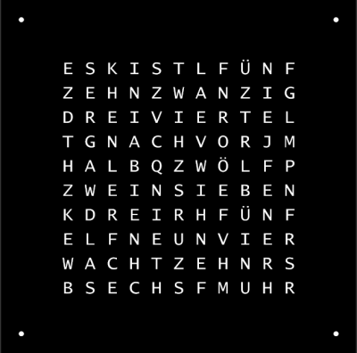

# DIY ARDUINO WORDCLOCK
created by sargantana 2017

licensed under GPL v2

## Circuit diagram 


## Step 1
Change pins in Pins.h according to your setup

```
#define MINUS         4   // Declare pin for + Button
#define PLUS          5 	// Declare pin for - Button
#define STEP          5 	// Declare step size of time adjustement
#define PIN           3 	// Declare pin for NeoPixel DATA IN
#define NUMPIXELS     25	// Declare amount of NeoPixels used
```

## Step 2
Change the Layout/Sequence of your word matrix in WordMatrix.h according to your setup

I used an older version of the WordClockFacePlate by microcontroller.net

A Newer version (in german) can be found here:
https://www.mikrocontroller.net/articles/WordClock_mit_WS2812



## Step 2.5 (Optional tweaking)
If desired you can cahnge the color pattern for the lighting depending if it is PM or AM

You can find these in wordclock/Arduino sketch/wordclock_sketch.ino

Example for AM color settings (pure blue)
```
// RGB values for AM
int AMr=0;
int AMg=0;
int AMb=255;
```

## Step 3
After double checking everything upload to arduino. Turn on the wordclock and set the time with the buttons.
