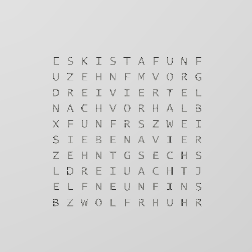

# DIY ARDUINO WORDCLOCK
created by sargantana 2017

licensed under GPL v2

### What is this?
A WordClock is a device displaying the time in 5 minutes increments on a matrix of words spelling the time.
This Project deals with a DIY approach as a alternative for the 1.250€ priced original product.

Time is displayed in 12h format, chnging color from green to blue depending if its AM or PM.
Pins.h is used to define the I/O of the used board, the increment you want to increase/decrease the time while setting it (recommended are 5 minutes for obvious reasons).
Use WordMatrix.h to define the layout of your word matrix. The sketch is written to tell time in english language, but as I am german I changed a few things in my specific setup. Feel free to improve and enhance the sketch for other languages or setups.


## Attenion!
This code uses the Adafruit_Neopixel and Time libary. They are absolutly neccessary for this to work.

Get NeoPixel Libary here: https://github.com/adafruit/Adafruit_NeoPixel

Get Time Libary here: https://github.com/PaulStoffregen/Time

## Recommended Hardware

* __(25x) WS2812b-based adressable LEDs (i.e. NeoPixel)__ // Number of Pixels used depends on you
* __2x Momentary push buttons__
* __Arduino based Board__
* __5V PSU capable of powering all Pixels at once + Arduino + overhead__ // you can calculate an average of ~65mA per Pixel
* __PCB__
* __Frame (i. e. IKEA Ribba picture frame)__
* __Faceplate__ // I lasercut this out of the IKEA Ribba backplate but you could also 3d print it

## Circuit diagram 


### Step 1
Change pins in Pins.h according to your setup

```
#define MINUS         4   // Declare pin for + Button
#define PLUS          5 	// Declare pin for - Button
#define STEP          5 	// Declare step size of time adjustement
#define PIN           3 	// Declare pin for NeoPixel DATA IN
#define NUMPIXELS     25	// Declare amount of NeoPixels used
```

### Step 2
Change the Layout/Sequence of your word matrix in WordMatrix.h according to your setup

I used an older version of the WordClockFacePlate by microcontroller.net

A Newer version (in german) can be found here:
https://www.mikrocontroller.net/articles/WordClock_mit_WS2812



There is a 3d printable .stl of this used faceplate 

### Step 2.5 (Optional tweaking)
If desired you can change the color pattern for the lighting depending if it is PM or AM

You can find these in the 

Example for AM color settings (pure blue)
```
// RGB values for AM
int AMr=0;
int AMg=0;
int AMb=255;
```

### Step 3
After double checking everything upload to arduino. Turn on the wordclock and set the time with the buttons.
